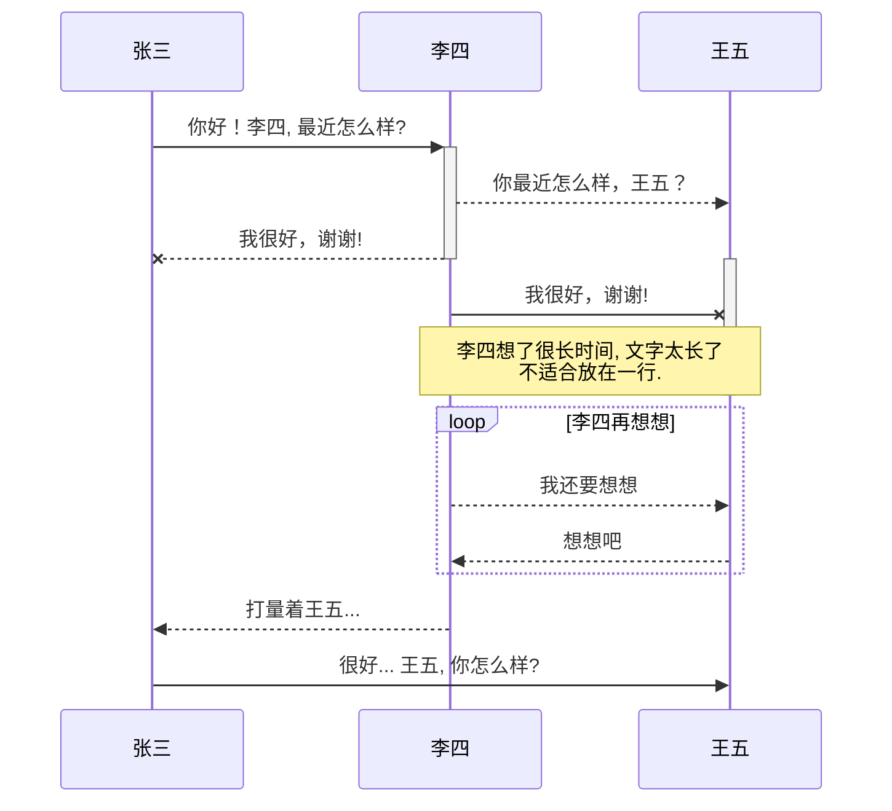

# markdown 中流程图详解

https://blog.csdn.net/suoxd123/article/details/84992282

```mermaid
graph TB
A[Apple]-->B{Boy}
A---C(Cat)
B.->D((Dog))
C==喵==>D
style A fill:#2ff,fill-opacity:0.1,stroke:#faa,stroke-width:4px
style D stroke:#000,stroke-width:8px;
```




实测，在本博客系统中不支持流程图特性，不过typora支持，这。。。反正不影响。先这么用着吧
